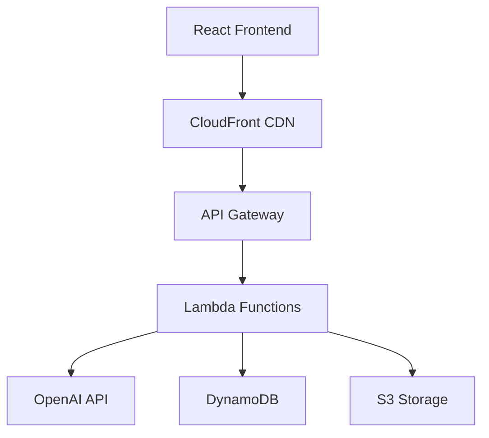

# 🎯 ContentScope

**AI-Powered Content Analysis & Optimization Platform**

[](https://github.com/yourusername/contentoscope/actions/workflows/ci.yml)
[](https://d3cjsi1eug3qxk.cloudfront.net)
[](https://kw1mp0na2e.execute-api.us-east-1.amazonaws.com/prod/api/v1)
[](https://opensource.org/licenses/MIT)

ContentScope helps content creators understand why their content fails, adapt it for different platforms, and learn how to improve using explainable AI.


## ✨ Features

- 🔍 **AI Content Analysis** - Deep analysis of content engagement factors
- 📊 **Platform Optimization** - Tailored suggestions for Twitter, LinkedIn, Instagram, Facebook, YouTube, and Blogs  
- ⚡ **Real-time Insights** - Instant feedback on content performance
- 🎨 **Beautiful UI** - Modern, responsive design with platform-specific branding
- ☁️ **Cloud-Native** - Fully deployed on AWS with global CDN
- 🚀 **Serverless** - Auto-scaling, cost-effective architecture

## 🚀 Quick Start

### Option 1: Try the Live Demo
Visit [ContentScope Live](https://d3cjsi1eug3qxk.cloudfront.net) to test the platform immediately.

### Option 2: Run Locally

```bash
# Clone the repository
git clone https://github.com/yourusername/contentoscope.git
cd contentoscope

# Install dependencies
npm install
cd frontend && npm install && cd ..
cd backend && npm install && cd ..

# Set up environment
cp .env.example .env
# Add your OpenAI API key to .env

# Start development server
cd frontend && npm run dev
```

Visit `http://localhost:3000` to see the app running locally.

### Option 3: Deploy to AWS

See [SETUP.md](SETUP.md) for complete deployment instructions.

## 🏗️ Architecture



**Tech Stack:**
- **Frontend**: React 18 + TypeScript + Tailwind CSS + Vite
- **Backend**: AWS Lambda + Node.js + TypeScript  
- **Database**: DynamoDB
- **Storage**: S3
- **CDN**: CloudFront
- **Infrastructure**: AWS CDK
- **AI**: OpenAI GPT-4

## 📊 API Usage

### Analyze Content
```bash
curl -X POST https://kw1mp0na2e.execute-api.us-east-1.amazonaws.com/prod/api/v1/analyze \
  -H "Content-Type: application/json" \
  -d '{
    "content": "Your content here",
    "contentType": "text", 
    "platforms": ["twitter", "linkedin"]
  }'
```

### Adapt Content
```bash
curl -X POST https://kw1mp0na2e.execute-api.us-east-1.amazonaws.com/prod/api/v1/adapt \
  -H "Content-Type: application/json" \
  -d '{
    "content": "Your content here",
    "targetPlatform": "instagram"
  }'
```

## 📁 Project Structure

```
contentoscope/
├── 📱 frontend/          # React TypeScript SPA
│   ├── src/pages/        # Application pages
│   ├── src/components/   # Reusable components  
│   └── src/services/     # API integration
├── ⚡ backend/           # AWS Lambda functions
│   ├── src/handlers/     # API route handlers
│   ├── src/services/     # Business logic
│   └── src/types/        # TypeScript definitions
├── 🏗️ infrastructure/    # AWS CDK deployment
├── 📚 docs/             # Documentation
└── 🔧 scripts/          # Build and deployment scripts
```

## 🛠️ Development

```bash
# Install all dependencies
npm run install:all

# Start development server
npm run dev

# Build all components
npm run build:all

# Run tests
npm run test

# Deploy to AWS
npm run deploy
```

## 🌐 Live Deployment

- **🌍 Website**: https://d3cjsi1eug3qxk.cloudfront.net
- **🔌 API**: https://kw1mp0na2e.execute-api.us-east-1.amazonaws.com/prod/api/v1
- **📊 Status**: All systems operational ✅

## 💰 Cost Structure

| Component | Development | Production |
|-----------|-------------|------------|
| AWS Services | Free Tier | $5-20/month |
| OpenAI API | Pay-per-use | $10-50/month |
| **Total** | **~$0** | **$15-70/month** |

## 🧪 Testing

```bash
# Run all tests
npm test

# Run specific test suites
cd backend && npm test
cd frontend && npm test
```

## 📚 Documentation

- 📖 [Setup Guide](SETUP.md) - Complete installation and deployment guide
- 🔌 [API Documentation](docs/API.md) - Detailed API reference
- 🚀 [Deployment Guide](docs/DEPLOYMENT.md) - AWS deployment instructions
- 💻 [Development Guide](docs/DEVELOPMENT.md) - Local development setup

## 🤝 Contributing

We welcome contributions! Please see our [Contributing Guide](CONTRIBUTING.md) for details.

1. Fork the repository
2. Create your feature branch (`git checkout -b feature/amazing-feature`)
3. Commit your changes (`git commit -m 'Add amazing feature'`)
4. Push to the branch (`git push origin feature/amazing-feature`)
5. Open a Pull Request

## 📄 License

This project is licensed under the MIT License - see the [LICENSE](LICENSE) file for details.

## 🙏 Acknowledgments

- [OpenAI](https://openai.com/) for AI capabilities
- [AWS](https://aws.amazon.com/) for cloud infrastructure  
- [React](https://reactjs.org/) & [TypeScript](https://www.typescriptlang.org/) communities
- All our [contributors](https://github.com/yourusername/contentoscope/contributors)

## 📞 Support

- 🐛 [Report Issues](https://github.com/yourusername/contentoscope/issues)
- 💬 [Discussions](https://github.com/yourusername/contentoscope/discussions)
- 📧 Email: support@contentoscope.com

---

<div align="center">

**⭐ Star this repo if you find it helpful!**

[Live Demo](https://d3cjsi1eug3qxk.cloudfront.net) • [Documentation](docs/) • [API Reference](docs/API.md)

</div>